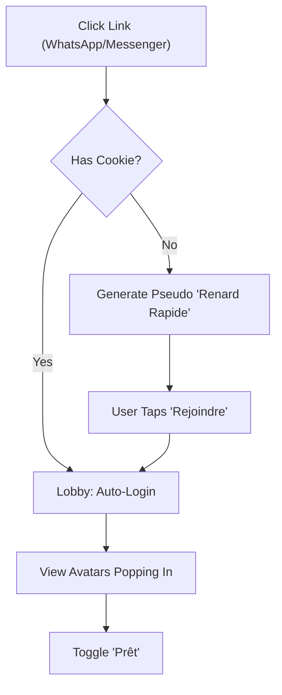
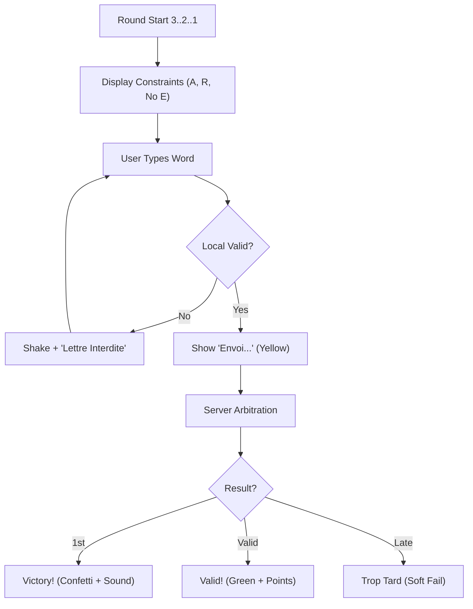
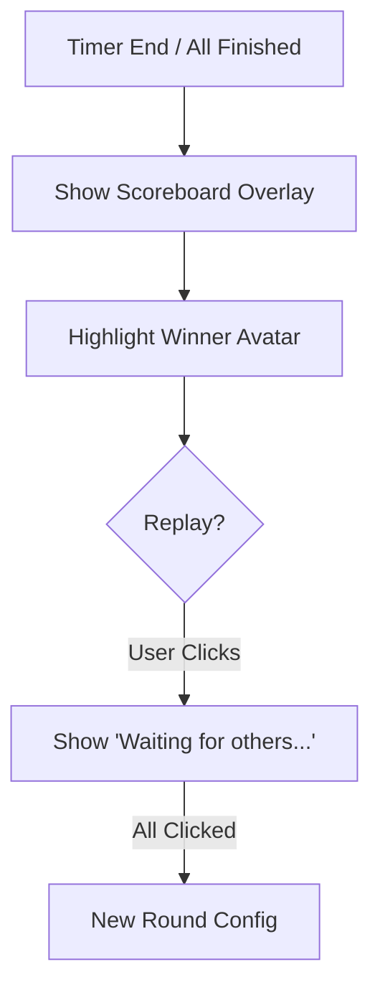

---
stepsCompleted:
  - 1
  - 2
  - 3
  - 4
  - 5
  - 6
  - 7
  - 8
  - 9
  - 10
  - 11
  - 12
  - 13
  - 14
inputDocuments:
  - prd.md
  - product-brief-motz-game-2026-01-12.md
  - architecture.md
---

# UX Design Specification: Motz-game

## Executive Summary

Motz-game is a real-time, multiplayer word association game designed for "micro-moments" of social fun. It targets young adults (18-35) looking for quick, adrenaline-fueled interactions via mobile messaging links.

**Core Value Proposition:** "L'adrénaline de l'évocation instantanée." (The adrenaline of instant evocation).

**Key Design Pillars:**

1.  **Speed:** Instant loading, zero-friction entry, snappy interactions.
2.  **Social:** Real-time presence, shared emotional highs/lows, easy sharing.
3.  **Simplicity:** Rules understood in 3 seconds, UI stripped to essentials.

**Design Opportunities:**

- **"Juicy" Feedback:** Utiliser des animations (confettis, secousses) et des sons satisfaisants pour chaque interaction.
- **Rétro 8-Bits Aesthetic:** Avatars animaux en pixel art, sons chiptune, ambiance arcade bienveillante.
- **Background Music:** Musique d'ambiance libre de droit pour renforcer l'immersion (style Lo-Fi ou Chiptune dynamique).

---

## Core User Experience

### Defining Experience

**Core Value Proposition:** "L'adrénaline de l'évocation instantanée."

L'expérience centrale de Motz-game repose sur cette adrénaline. Le joueur doit ressentir une tension positive stimulée par le chronomètre et la compétition, suivie d'une libération immédiate et gratifiante (feedback "Juicy") lorsqu'il valide un mot correct. Tout doit converger vers cette boucle de jeu : _Percevoir la contrainte -> Trouver le mot -> Valider -> Feedback immédiat_.

**"The Cognitive Snap" (Le Déclic Cognitif)**

Pour atteindre cette adrénaline, le joueur doit résoudre un puzzle instantané sous pression.

- **Concept :** Le moment précis où le cerveau "déclic" : il voit `Imposé: A, R` + `Interdit: E`, il panique une demi-seconde (Stress Positif), puis le mot "PARC" jaillit.
- **La boucle :** Scan Visuel (Contraintes) → Scan Mental (Vocabulaire) → Frappe Réflexe → Validation.

* **Success Criteria :**
  - **Lisibilité Instantanée :** Les contraintes (Vert = Imposé, Rouge = Interdit) doivent être décodées par le cerveau en < 200ms, comme des feux de signalisation.
  - **Feedback Éducatif :** Si je tape "PERDU" alors que "E" est interdit, le jeu entoure le "E" en rouge et secoue l'écran. Il m'explique mon erreur instantanément.

### Platform Strategy

- **Primary Platform :** Web Mobile (PWA). Le jeu est conçu pour être lancé depuis une messagerie instantanée (WhatsApp, Messenger) sur un smartphone.
- **Secondary Platform :** Desktop Web. Pour les pauses au bureau ou le confort à la maison.
- **Key Constraints :**
  - **Mobile Keyboard Management :** L'interface doit s'adapter parfaitement à l'apparition du clavier virtuel (viewport resize) sans masquer les éléments critiques (la contrainte, le timer, le feedback).
  - **Network Resilience :** Le jeu doit rester réactif même en 3G/4G instable (gestion optimiste de l'UI).

### Effortless Interactions

1.  **"Zero-Click" Join :** Un lien partagé mène directement dans le lobby. Si le joueur a déjà un pseudo (cookie), il est prêt à jouer. S'il n'en a pas, un pseudo animalier aléatoire est généré (ex: "Renard Rapide") qu'il peut valider d'un tap.
2.  **Smart Input Focus :** Sur mobile, le clavier ne doit pas masquer le jeu. Sur desktop, le champ de saisie a toujours le focus, même si l'utilisateur clique ailleurs par erreur.
3.  **Validation "Trigger-Happy" :** Pas de punition sévère pour une faute de frappe, mais un feedback clair. La touche "Entrée" ou un gros bouton d'action accessible au pouce permettent de valider sans regarder.

### Critical Success Moments

1.  **L'Arrivée dans le Lobby (The Gathering) :** Voir les avatars des amis "popper" à l'écran en temps réel crée l'engagement social immédiat. C'est le moment où on se dit "ça va être drôle".
2.  **Le Premier Feedback "Juicy" :** La première validation réussie avec son et animation confirme que le jeu répond bien et gratifie l'utilisateur.
3.  **La Fin de Manche (The Reveal) :** Le tableau des scores doit être instantanément lisible pour désigner le vainqueur et lancer les vannes ("trash talk") entre amis.

### Experience Principles

1.  **Speed is King :** Aucune animation d'interface ne doit ralentir l'action du joueur. Les transitions sont vives (snappy).
2.  **Feedback is Truth :** Le jeu communique en permanence son état. Si un mot est refusé, on sait pourquoi (déjà dit, invalide) en moins de 100ms.
3.  **Context Aware :** L'interface s'adapte si je suis dans le métro (boutons plus gros, contraste élevé) ou au calme.

### Advanced UX Mechanics

#### Mobile Viewport Strategy (The "Focus Mode")

Avec un clavier virtuel occupant près de 40% de l'écran (ne laissant qu'un tiers utile), l'interface bascule en **"Focus Mode"** pour préserver la lisibilité sans masquer l'essentiel :

- **Sticky Top Bar (Vital) :** La Contrainte (ex: "Lettres: A, R" / "Interdit: E") et le Timer sont verrouillés en haut.
- **Sticky Bottom (Action) :** Le champ de saisie est ancré au clavier.
- **Smart Arena (Context) :**
  - Masquage des avatars inactifs pour gagner de l'espace.
  - Affichage exclusif d'un "Live Feed" minimaliste (bulles d'activité) pour sentir la présence des autres sans encombrer.
  - Le feedback (succès/échec) se joue en overlay transparent (HUD) par-dessus l'arène.

#### Latency & Feedback Management

Pour gérer le délai réseau sans frustrer, une boucle de feedback en 3 temps est mise en place :

1.  **Input & Local Check (Bloom Filter) :**
    - Dès la validation, le Bloom Filter vérifie la validité lexicale.
    - _Feedback immédiat :_ "Analyse..." / "Envoi..." (Bordure jaune, loader). L'utilisateur sait que son mot est valide et parti.
2.  **Server Arbitrator :** Le serveur reçoit les inputs et détermine l'ordre d'arrivée millimétré (le classement réel).
3.  **Final Resolution (Ranked Scoring) :**
    - _Premier (Max Points) :_ L'état "Analyse..." explose en "Victoire !" (Confettis + Son spécial).
    - _Suivants (Points Dégressifs) :_ L'état "Analyse..." se transforme en "Validé !" (Couleur positive, ex: Vert clair/Bleu). Le joueur reçoit des points selon son rang (2ème, 3ème...), valorisant la rapidité sans punir totalement le petit retard.

#### Competitive Fairness (Thinking > Typing)

Pour privilégier la vitesse de réflexion sur la vitesse de frappe, sans distorsion artificielle du temps :

- **Typo Tolerance (Fuzzy Matching) :** Tolérance stricte mais juste sur les fautes de frappe (Distance de Levenshtein).
  - 1 erreur tolérée pour les mots > 5 lettres.
  - _Pas de bonus de temps :_ Le chrono est le même pour tous (équité totale).
- **Native Assistance :** Activation autorisée des suggestions natives (autocorrect) du clavier mobile pour compenser le manque de retour tactile, permettant de se concentrer sur le mot plutôt que la frappe.

---

## Desired Emotional Response

### Primary Emotional Goals

1.  **"Pixelated Dopamine" (Gratification Immédiate)**
    - Chaque validation doit déclencher une micro-décharge de plaisir (son 8-bits, secousse visuelle). Le joueur doit avoir envie de trouver un mot juste pour _voir_ le feedback.
2.  **"Arcade Tension" (Stress Positif)**
    - Une pression temporelle stimulante qui pousse à la concentration extrême (Tunnel Vision), mais qui relâche tout à la fin du round dans un fou rire collectif.
3.  **"Trusted Fairness" (Sécurité)**
    - La certitude absolue que le jeu ne triche pas. Si je perds, c'est que j'ai été lent, pas que l'interface a buggé ou que le réseau a lagué.

### Emotional Journey Mapping

- **Discovery (Lobby) :** _Excitation & Appartenance._ "Mon avatar est cool, la musique est entraînante, je suis prêt à en découdre."
- **Action (Typing) :** _Focus Intense._ Le monde extérieur disparaît. Je ne vois que les contraintes (lettres) et mon clavier.
- **Wait (Latency) :** _Espoir._ "Analyse..." -> Je retiens mon souffle.
- **Result (Success) :** _Explosion de Joie._ Confettis, bruitage "Power-Up". Je me sens intelligent et rapide.
- **Result (Fail) :** _Dédramatisation._ "Ah mince !" -> Mon avatar fait une tête drôle. Je veux recommencer tout de suite (Replayability).

### Micro-Emotions

- **Confident** (quand l'autocorrect m'aide sans me trahir)
- **Acknowledged** (quand le feedback "Analyse..." apparaît instantanément)
- **Nostalgic** (par les sons chiptune et les visuels 8-bits)
- **Safe** (pas de peur d'être ridiculisé par un "Game Over" humiliant)

### Sensory & Aesthetic Experience

#### 1. Audio Identity (8-Bit Chiptune)

L'audio porte 50% du feedback émotionnel.

- **Validation (Success):** Arpège montant rapide (Do-Mi-Sol). Son brillant et "croquant".
- **Refus (Soft Fail):** Son descendant "mou" (Bloop). Informatif, non punitif.
- **Tension (Timer):** Accélération dynamique du BPM de la musique de fond (pas de bip-bip strident).
- **Latency Feedback:** Son de "Whoosh" montant pendant l'état "Analyse..." pour combler le vide.

#### 2. Audio & Haptic Resources (Free/Commercial Use)

- **Sound Effects (SFX) - The "Crunchy" Feedback:**
  - **Generator (Top Pick):** [jsfxr](https://sfxr.me/) (Web) - Idéal pour générer tes propres sons (Coin, Jump, Explosion) uniques en 2 secondes. Gratuit & Open Source.
  - **Libraries:**
    - **OpenGameArt.org:** "512 Sound Effects (8-bit style)" (License CC0 - Domaine Public).
    - **Freesound.org:** Pack "LittleRobotSoundFactory" (Qualité top, vérifier licence CC-BY).
- **Background Music (BGM) - The "Arcade" Vibe:**
  - **Ozzed.net:** La référence Chiptune libre. (License CC-BY : nécessite juste un lien dans les crédits).
  - **ElevenLabs/AI:** Pour générer des boucles d'ambiance infinies sans copyright.
- **Haptic Strategy:**
  - **Vibration API:** `navigator.vibrate([50, 30, 50])` pour un succès "croustillant".
  - **Visual Shake:** CSS `transform: translate(2px, 0)` rapide pour simuler l'impact.

#### 3. Haptic Language (Mobile First)

Le toucher confirme ce que les yeux voient.

- **Succès:** Vibration unique, nette et courte (Crisp Tick).
- **Erreur:** Double vibration lourde (Heavy Thud).
- **Urgence:** Battement de cœur subtil dans les 5 dernières secondes (Désactivable).

#### 4. Emotional Color Palette (Neo-Retro)

Contraste élevé "Néon sur Sombre" pour l'accessibilité et l'ambiance.

- **Canvas:** `Deep Arcade Blue` (#121220) - Reposant, immersif.
- **Success:** `Power-Up Green` (#39FF14) - Électrique, gratifiant.
- **Danger:** `Hot Pink` (#FF00FF) - Alerte ludique, remplace le rouge agressif.
- **Waiting:** `Laser Lemon` (#FFFF00) - Actif, lumineux.

### Design Implications

- **Audio-First Emotion :** Le son (Sound Design 8-bits) portera 50% de l'émotion. Un son de "validation" montant (arpège majeur) pour le succès, un son "descendant" (bruit blanc) doux pour l'échec.
- **Visual "Crunch" :** Les animations ne doivent pas être fluides (60fps lisse) mais avoir du "punch" (courbes d'animation élastiques, stop-motion style) pour renforcer le côté rétro/arcade.
- **Honest UI :** Si le réseau lag, l'UI l'affiche (petite icône "Wifi instable"). Ne jamais laisser le joueur deviner.

---

## Design System Strategy

### Chosen Approach: "Pixel-Pop Hybrid"

We will leverage **Shadcn/UI** for its robust accessibility and functional core, but heavily customize the visual layer via **Tailwind CSS** to achieve the "Neo-Retro Arcade" aesthetic.

### Core Visual Rules (The "Crunchy" Look)

1.  **Zero-Radius Policy:** `rounded-none` globally. No soft corners.
2.  **Thick Borders:** `border-4` (Black #000000) on all interactive elements to simulate 8-bit sprites.
3.  **Hard Shadows:** `shadow-[6px_6px_0px_0px_#000]` (No blur). Elements must feel physical and clickable.
4.  **Typography:**
    - **Headings/Accents:** _Press Start 2P_ (Google Fonts) - For drama, scores, and big feedbacks.
    - **Body/Input:** _VT323_ (Google Fonts) - Large scale (24px+) for maximum readability and retro immersion.

### Visual Foundation (Option B: True 8-Bit)

- **Colors:**
  - Canvas: `#121220` (Dark Blue)
  - Success: `#39FF14` (Neon Green)
  - Danger: `#FF00FF` (Magenta)
  - Waiting: `#FFFF00` (Yellow)
- **Components:**
  - Inputs: `bg-white text-black` with `border-4 border-black`
  - Buttons: `bg-[#39FF14] text-black` with `border-4 border-black`

---

## User Journey Flows

### 1. Instant Join (The "Zero-Friction" Entry)

The goal is to get the player from a chat link to the lobby in under 3 seconds.

### 2. The Core Loop (Cognitive Snap)

The high-frequency loop where the "Adrenaline" happens.

### 3. End of Round (Social Resolution)

Instant clarity on who won to fuel the social interaction.

### Flow Optimization Principles

1.  **Optimistic UI:** Always show "Envoi..." immediately after local validation. Never make the user wait for the network to confirm they hit "Enter".
2.  **Error Recovery:** If a word is rejected locally, do not clear the input completely. Highlight the error (e.g., the forbidden letter) so the user can fix it (Backspace) instead of retyping everything.
3.  **One-Handed Flow:** All critical buttons (Valider, Prêt, Rejouer) must be in the "Thumb Zone" (bottom 30% of screen).

---

## Component Strategy

### Design System Components (Shadcn/UI Base)

We leverage Shadcn/UI for accessibility (Radix primitives) but override styles for the "Neo-Retro" look.

- **Button:** Base `Button` component, overridden with `rounded-none border-4 border-black shadow-[6px_6px_0px_0px_#000]`.
- **Input:** Base `Input`, overridden with `font-vt323 text-3xl h-16 border-4 border-black focus:ring-0`.
- **Dialog:** Used for "Game Over" and "Join" screens. Backdrop blur removed, replaced with 80% opacity black.
- **Toast:** Used for system notifications ("Lien copié"). Styled as a pixelated notification box.
- **Avatar:** Base `Avatar` component. Images are strictly 8-bit pixel art PNGs/SVGs.

### Custom Components

1.  **ConstraintBadge**

    - **Purpose:** Display the round rules (Required/Forbidden letters).
    - **Anatomy:** Rectangular badge, `border-2 border-black`.
    - **States:**
      - _Required:_ Green background (`bg-[#39FF14]`), Text Black.
      - _Forbidden:_ Red background (`bg-[#FF00FF]`), Text White, Strikethrough.
    - **Animation:** Pulses when the user types a forbidden letter.

2.  **RetroTimer**

    - **Purpose:** Create tension.
    - **Anatomy:** Large `VT323` text.
    - **States:**
      - _Normal:_ Yellow (`#FFFF00`).
      - _Critical (<5s):_ Red (`#FF0000`) + Shake animation.

3.  **LiveArena**

    - **Purpose:** Show other players' status without clutter.
    - **Anatomy:** Grid container.
    - **Behavior:** On mobile, collapses to a single row of "Active" avatars to save vertical space for the keyboard.

4.  **FeedbackOverlay**
    - **Purpose:** The "Juice" layer.
    - **Anatomy:** `fixed inset-0 pointer-events-none z-50`.
    - **Content:** Confetti canvas, large text animations ("VICTOIRE").

### Implementation Roadmap

1.  **Phase 1: The Core Loop (MVP)**
    - Implement `ConstraintBadge`, `RetroTimer`, and the customized `Input` + `Button`.
    - Goal: A playable single-player mode to test the "Cognitive Snap".
2.  **Phase 2: The Social Layer**
    - Implement `LiveArena` and `Avatar` system.
    - Goal: Multiplayer synchronization visualization.
3.  **Phase 3: The Juice (Polish)**
    - Implement `FeedbackOverlay`, Sound Manager, and Haptics.
    - Goal: Achieving the "Pixelated Dopamine" emotional goal.

### Implementation Stack

- **Framework:** Next.js 15 (App Router)
- **Styling:** Tailwind CSS v4
- **Component Library:** Shadcn/UI (Radix Primitives)
- **Icons:** Lucide React (Stroke width: 2px or 3px for weight)

---

## UX Pattern Analysis & Inspiration

### Inspiring Products Analysis

1.  **Kahoot! (L'Ambiance de Groupe)**

    - _Core Problem Solved:_ Rendre un QCM ennuyeux en événement social excitant.
    - _Key Lesson:_ **"The Lobby is the Hype Man"**. L'attente n'est pas passive. Voir les pseudos des autres s'afficher crée la pression sociale positive avant même le début du jeu.
    - _Adaptation Motz:_ Un lobby vivant où les avatars animaux réagissent (clignent des yeux, sautillent) à chaque nouvelle arrivée.

2.  **Duolingo (Le Feedback Affectif)**

    - _Core Problem Solved:_ Maintenir la motivation malgré l'échec répété.
    - _Key Lesson:_ **"Character-Driven Feedback"**. Ce n'est pas le système qui vous juge, c'est un personnage mignon.
    - _Adaptation Motz:_ Si je perds, mon avatar animal fait une tête triste (oreille basse) ou choquée, ce qui désamorce la frustration.

3.  **Crossy Road (L'Arcade "One-Tap")**
    - _Core Problem Solved:_ Rejouabilité infinie avec une action unique.
    - _Key Lesson:_ **"Instant Restart"**. Mourir prend 0.5s. Rejouer prend 0.1s.
    - _Adaptation Motz:_ À la fin de la manche, le bouton "Rejouer" est énorme. Pas de récapitulatif laborieux de 3 pages.

### Transferable UX Patterns

**Interaction Patterns:**

- **The "Shake" Denial :** Comme sur l'écran de login Mac/iOS. Si le mot est invalide, l'input secoue la tête "Non" latéralement. C'est universel et sans texte.
- **The "Confetti" Burst :** Explosion de particules depuis le point d'interaction (le bouton valider) pour récompenser l'action.

**Visual Patterns:**

- **Progressive Disclosure :** Ne pas afficher toutes les règles au début. Juste "Trouve un mot avec A et R". Les subtilités (points, bonus) s'apprennent en jouant.
- **Big & Chunky UI :** Boutons épais, ombres portées marquées, typographie grasse. Cela crie "Je suis un jeu" et facilite le tactile.

### Anti-Patterns to Avoid

1.  **Le "Keyboard Overlay" Surprise :**
    - _Problème :_ Le clavier s'ouvre et cache le bouton valider ou le timer.
    - _Solution :_ Notre "Focus Mode" (Sticky Bottom) est non-négociable.
2.  **Le "Loading Spinner" Silencieux :**
    - _Problème :_ Ne pas savoir si mon mot est parti.
    - _Solution :_ Feedback immédiat "Analyse..." (Local) avant même la réponse serveur.
3.  **La Punition Humiliante :**
    - _Problème :_ Sons d'erreur agressifs (Buzzers télévisuels) ou écrans "GAME OVER" rouges sanglants.
    - _Solution :_ Rester dans le ton bienveillant/drôle même dans la défaite.

### Design Inspiration Strategy

**Strategy: "Arcade Social Club"**
Nous adoptons la **visceralité** des jeux d'arcade (Sons, Feedbacks physiques, Rapidité) et nous l'enveloppons dans la **douceur** des apps sociales modernes (Avatars mignons, Bienveillance, Simplicité).

---

## UX Consistency Patterns

### Button Hierarchy

- **Primary (Action):** Neon Green (`#39FF14`) background, Black text, Thick Black Border (`border-4`). Used for the main action on screen ("Valider", "Prêt", "Rejoindre").
- **Secondary (Alternative):** Transparent background, White text, Thick Black Border. Used for "Annuler", "Retour".
- **Ghost (Contextual):** No border, simple text with underline on hover. Used for footer links or secondary options.

### Feedback Patterns

- **Success:** Visual (Green Border + Confetti) + Audio (Chime) + Haptic (Light Tick).
- **Error:** Visual (Red Border + Shake) + Audio (Bloop) + Haptic (Heavy Thud).
- **System Info:** Toast notification (Pixelated box) at the top of the screen.

### Navigation Patterns

- **Sticky Bottom Bar:** Critical actions (Input, Main Button) are always pinned to the bottom (or top of keyboard) to ensure reachability.
- **Back Navigation:** Top-left pixelated arrow icon. Always visible in sub-screens.

### Modal Patterns

- **Overlay:** Black with 80% opacity (`bg-black/80`). No blur (keep it crisp).
- **Dialog Box:** Centered, White background, Thick Black Border. No rounded corners.

---

## Responsive Design & Accessibility

### Responsive Strategy (Mobile-First)

- **Mobile (< 768px):** The game occupies 100% of the viewport.
  - _Focus Mode:_ When keyboard is open, non-essential elements (Avatars, Header) are hidden or minimized to prioritize the Input and Constraints.
- **Desktop (>= 768px):** The game is contained in a central "Arcade Cabinet" (max-width 480px).
  - _Background:_ The empty space around the container displays a tiled pixel-art wallpaper.

### Accessibility Strategy (WCAG AA Target)

1.  **Color Contrast:**
    - Black Text on Neon Green Background = **14:1 Ratio** (AAA).
    - White Text on Dark Blue Background = **16:1 Ratio** (AAA).
2.  **Reduced Motion:**
    - If `prefers-reduced-motion` is detected: Disable Confetti, Shake animations, and Background parallax.
3.  **Screen Readers:**
    - **ARIA Live Regions:** The Timer and Feedback messages ("Analyse...", "Victoire") must be announced dynamically.
    - **Keyboard Navigation:** Full tab support for desktop players.

### Testing Strategy

- **Device Lab:** Test on iPhone SE (Smallest), Pixel (Android), and Desktop Chrome.
- **Network Conditioning:** Test with "Slow 3G" throttling to verify the Optimistic UI ("Envoi...").
